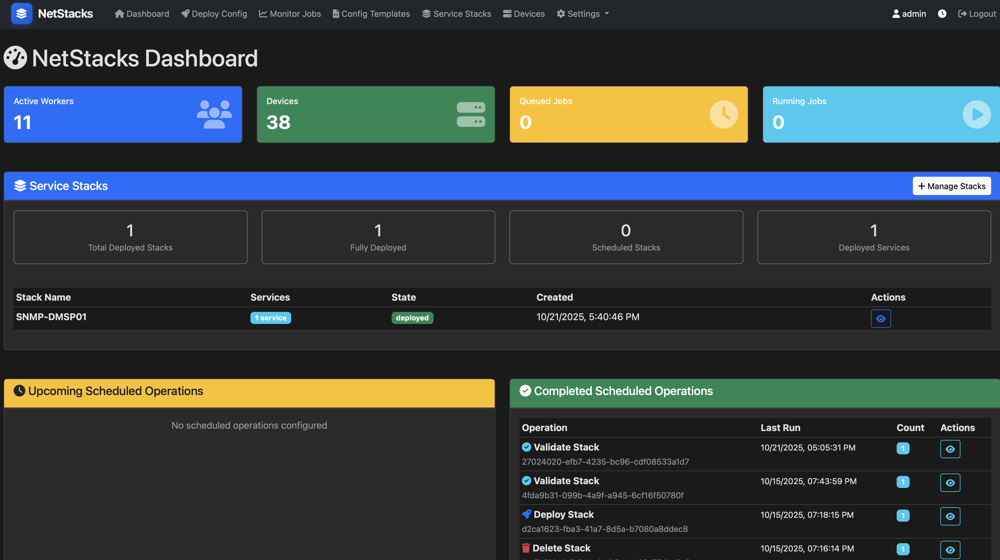
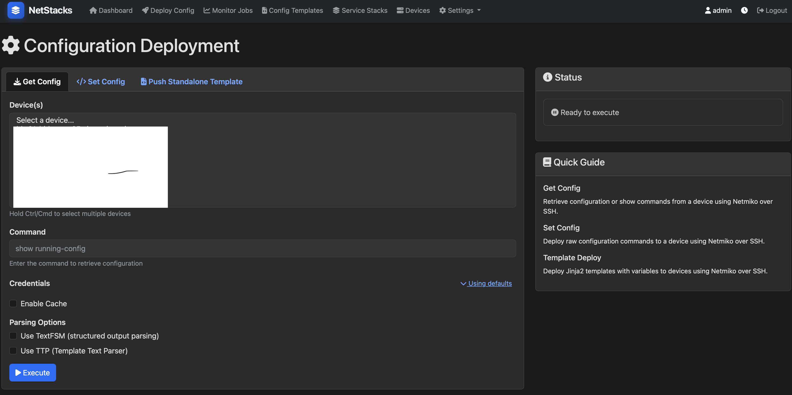
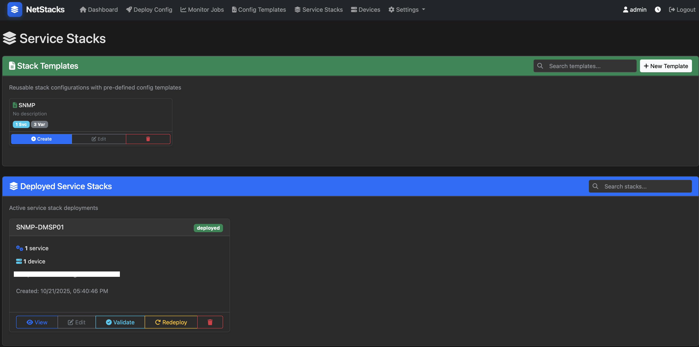
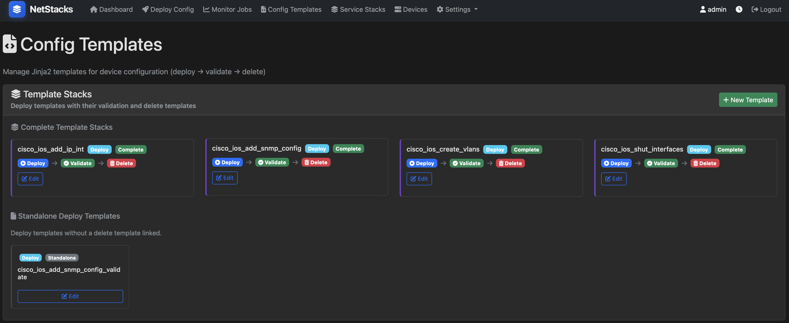

# NetStacks

**Web-based Service Stack Management for Network Automation**

NetStacks is an open-source web application that provides a modern interface for managing network device configurations using template-based service stacks. It simplifies network automation with an intuitive UI for deploying, validating, and managing configuration services across your network infrastructure.

**Note**: The Netstacker backend platform included with NetStacks is a fork of [Netpalm](https://github.com/tbotnz/netpalm), providing enhanced features and integration for network automation.

## 🚀 Features

### Network Configuration Management
- **Template-Based Services**: Deploy configurations using Jinja2 templates with variable substitution
- **Service Stacks**: Group related services and deploy them as a stack with dependency management
- **Validation**: Automatically validate deployed configurations against device running configs
- **Delete Operations**: Clean removal of configurations using delete templates
- **Multi-Device Support**: Deploy services to multiple devices simultaneously
- **Netbox Integration**: Automatically fetch device inventory from Netbox
- **Real-time Monitoring**: Track deployment progress and job status
- **Template Metadata**: Link validation and delete templates to service templates

### 🔄 MOP (Method of Procedures) Engine
- **Visual MOP Builder**: Drag-and-drop interface for creating complex procedures without writing YAML
- **Intelligent Step Types**: Auto-discovered from Python code - add new step types by adding functions
- **Dynamic Forms**: Parameter fields adapt based on selected step type
- **Conditional Logic**: Define success/failure paths for each step (on_success/on_failure)
- **Bidirectional Editing**: Switch seamlessly between Visual Builder and YAML editor
- **Execution Tracking**: Complete history and status tracking for all MOP executions
- **Multiple Step Types**: SSH commands, delays, email notifications, HTTP requests, Python validation, and more

### 🔐 Authentication & User Management
- **🔐 Enterprise Authentication**: Flexible multi-method authentication system
  - **Local Authentication**: Database-backed username/password authentication
  - **LDAP / Active Directory**: Enterprise directory integration with STARTTLS support
  - **OAuth2 / OpenID Connect (OIDC)**: Single Sign-On with Google, Azure AD, Okta, etc.
  - **Priority-Based Authentication**: Configure authentication order (try local first, LDAP second, etc.)
  - **Auto-Provisioning**: Automatic user account creation for LDAP/OIDC users
  - **Per-User Auth Tracking**: Visual badges show authentication source (Local/LDAP/SSO)
- **👥 User Management**: Comprehensive user administration
  - Create and manage local user accounts
  - Delete user accounts (except admin)
  - Password management for local users (LDAP/OIDC users managed externally)
  - User authentication source tracking and display
- **🌐 Offline Operation**: Fully functional without internet connectivity

## 📸 Screenshots

### Dashboard - Service Overview

*Real-time view of deployed services, validation status, and recent activity*

### Deploy Configuration - Template-Based Deployment

*Deploy network configurations using Jinja2 templates with variable substitution*

### Service Stacks - Multi-Service Orchestration

*Create and manage service stacks with dependency ordering and bulk operations*

### Config Templates - Template Management

*Create, edit, and manage Jinja2 configuration templates with metadata linking*

## 📋 Prerequisites

1. **Docker & Docker Compose**: For containerized deployment
2. **(Optional) Netbox**: For automatic device inventory management

## 🚀 Quick Start

**NetStacks now includes the complete platform!** The unified docker-compose deploys both:
- **NetStacks Web UI** (port 8089) - Frontend interface
- **Netstacker Backend** (port 9000) - API automation engine

### 1. Clone the Repository

```bash
git clone https://github.com/viperbmw/netstacks.git
cd netstacks
```

### 2. (Optional) Customize Configuration

```bash
cp .env.example .env
# Edit .env to customize API keys and ports if needed
```

### 3. Deploy the Complete Platform

```bash
docker-compose up -d
```

This will start 5 containers:
- `netstacks` - Web UI
- `netstacker-controller` - API server
- `netstacker-worker-pinned` - Task worker (pinned queue)
- `netstacker-worker-fifo` - Task worker (FIFO queue)
- `netstacker-redis` - Queue and cache

### 4. Access the Platform

- **NetStacks Web UI**: `http://localhost:8089`
- **Netstacker API**: `http://localhost:9000`
- **Netstacker Swagger UI**: `http://localhost:9000`

The Web UI is pre-configured to connect to the backend API automatically!

### 5. Default Login

- **Username**: `admin`
- **Password**: `admin`

**⚠️ Important**: Change the default password immediately after first login!

### 6. (Optional) Configure Authentication

NetStacks supports multiple authentication methods. Configure them via **Settings → Users & Auth → Authentication Settings**:

#### Local Authentication (Default)
- Database-backed username/password authentication
- Change password via user settings
- Set priority order relative to other auth methods

#### LDAP / Active Directory
1. Navigate to **Authentication Settings** tab
2. Configure LDAP settings:
   - **Server**: LDAP server hostname/IP (e.g., `ldap.example.com`)
   - **Port**: 389 (LDAP) or 636 (LDAPS)
   - **Base DN**: Search base (e.g., `dc=example,dc=com`)
   - **User Filter**: LDAP filter (e.g., `(uid={username})`)
   - **Bind DN**: Admin bind DN (optional)
   - **Use SSL/TLS**: Enable for secure connections
   - **Priority**: Set authentication order (lower = higher priority)
3. Click **Test Connection** to validate settings
4. Enable LDAP authentication

#### OAuth2 / OpenID Connect (OIDC)
1. Configure your identity provider (Google, Azure AD, Okta, etc.)
2. Navigate to **Authentication Settings** → **OIDC Configuration**
3. Enter OIDC settings:
   - **Issuer URL**: Your IdP's issuer URL (e.g., `https://accounts.google.com`)
   - **Client ID**: OAuth2 client ID from your IdP
   - **Client Secret**: OAuth2 client secret
   - **Redirect URI**: `http://your-server:8089/login/oidc/callback`
   - **Priority**: Set authentication order
4. Click **Test Configuration** to validate
5. Enable OIDC authentication
6. A "Sign in with SSO" button will appear on the login page

#### Authentication Priority
Configure which authentication method is tried first:
- Lower priority numbers = tried first
- Example: Local (priority 10), LDAP (priority 20), OIDC (priority 30)
- Users are authenticated by the first successful method

### 7. (Optional) Configure Netbox Integration

1. Go to `http://localhost:8089/settings`
2. Add your Netbox connection details:
   - **Netbox URL**: Your Netbox server URL
   - **Netbox Token**: Your Netbox API token

## 🌐 Architecture

NetStacks is a **complete network automation platform** with integrated frontend and backend:

```
┌─────────────────────────────────────────────────────────┐
│                    NetStacks Platform                    │
├─────────────────────────────────────────────────────────┤
│                                                          │
│  ┌──────────────┐         ┌──────────────────────────┐ │
│  │  NetStacks   │  REST   │  Netstacker Backend      │ │
│  │   Web UI     │ ◄─────► │  ┌────────────────────┐  │ │
│  │  (Flask)     │   API   │  │ FastAPI Controller │  │ │
│  │  + SQLite    │         │  ├────────────────────┤  │ │
│  └──────────────┘         │  │ Pinned Worker      │  │ │
│       Port 8089           │  ├────────────────────┤  │ │
│                           │  │ FIFO Worker        │  │ │
│                           │  ├────────────────────┤  │ │
│                           │  │ Redis Queue/Cache  │  │ │
│                           │  └────────────────────┘  │ │
│                           │       Port 9000          │ │
│                           └──────────────────────────┘ │
│                                       │                 │
└───────────────────────────────────────┼─────────────────┘
                                        │ SSH/Telnet
                                        ▼
                              Network Devices

                 Optional: Netbox Integration ◄────────┘
```

**Key Points:**
- **Unified Platform**: Both frontend and backend deploy together
- **Pre-integrated**: Web UI automatically connects to backend API
- **Microservices**: Scalable worker architecture for task processing
- **Persistent Storage**: SQLite for UI data, Redis for task queuing
- **Network Automation**: Direct device access via Netmiko (SSH/Telnet)

## 📁 Directory Structure

```
netstacks/
├── app.py                      # Flask application (Web UI)
├── database.py                 # SQLite database layer
├── mop_engine.py               # MOP execution engine
├── step_types_introspect.py   # Auto-discovery of step types
├── auth_ldap.py                # LDAP authentication module
├── auth_oidc.py                # OIDC/OAuth2 authentication module
├── netbox_client.py            # Netbox API client
├── requirements.txt            # Python dependencies
├── Dockerfile                  # NetStacks Web UI container
├── docker-compose.yml          # Complete platform deployment
├── .env.example                # Environment variable template
├── templates/                  # HTML templates (Flask)
│   ├── base.html
│   ├── index.html
│   ├── services.html
│   ├── service-stacks.html
│   ├── mop.html                # MOP management page
│   └── ...
├── static/                     # Static assets (CSS, JS)
│   ├── css/
│   │   └── style.css
│   └── js/
│       ├── services.js
│       ├── service-stacks.js
│       ├── mops.js             # MOP management
│       ├── visual-builder.js   # Visual MOP Builder
│       └── ...
└── netstacker/                 # Backend API platform
    ├── docker-compose.yml      # Backend-only deployment (optional)
    ├── netstacker/             # Backend Python code
    │   ├── netstacker_controller.py
    │   ├── backend/
    │   │   ├── core/
    │   │   └── plugins/
    │   └── routers/
    ├── dockerfiles/            # Backend Dockerfiles
    ├── config/                 # Backend configuration
    └── tests/                  # Backend tests
```

**Note**: Jinja2 configuration templates are stored in the Netstacker backend under `netstacker/netstacker/backend/plugins/extensibles/j2_config_templates/`

## 🛠️ Usage

### Creating Templates

1. Navigate to **Templates** page
2. Create a new Jinja2 template (e.g., `add_snmp.j2`)
3. Define template variables using `{{ variable_name }}` syntax
4. Optionally link validation and delete templates
5. Click **Save to Netstacker** - templates are stored in Netstacker

**Example Template:**
```jinja2
snmp-server community {{ snmp_community }} {{ snmp_mode }}
snmp-server location {{ snmp_location }}
snmp-server contact {{ snmp_contact }}
```

**Note**: Templates are stored in Netstacker, not locally. NetStacks uses Netstacker's template rendering engine for all deployments.

### Deploying Services

1. Go to **Services** page
2. Click **Deploy New Service**
3. Select a template
4. Fill in template variables
5. Select target device(s)
6. Click **Deploy**

### Creating Service Stacks

1. Navigate to **Service Stacks** page
2. Click **Create Stack**
3. Add services to the stack
4. Define dependencies between services
5. Save and deploy the stack

### Creating and Running MOPs (Method of Procedures)

MOPs allow you to automate complex, multi-step network procedures with conditional logic.

#### Using the Visual Builder

1. Navigate to **Procedures (MOP)** page
2. Click **New** to create a new MOP
3. Enter MOP name and description
4. Click the **Visual Builder** tab
5. Add target devices using the device selector
6. Click **Add Step** to add procedure steps:
   - Choose a step type (SSH Command, Delay, Email, HTTP Request, etc.)
   - Fill in the dynamic parameter form
   - Define success/failure transitions (optional)
7. Click **Generate YAML** to convert to YAML format
8. Click **Save** to store the MOP
9. Click **Execute** to run the MOP on target devices

#### Using the YAML Editor

1. Navigate to **Procedures (MOP)** page
2. Click **New** to create a new MOP
3. Click the **YAML Editor** tab
4. Write your MOP in YAML format:

```yaml
name: "Maintenance Window Example"
description: "Disable BGP, perform maintenance, re-enable BGP"
devices:
  - router1.example.com
  - router2.example.com

steps:
  - name: "Disable BGP"
    id: disable_bgp
    type: ssh_command
    command: "configure terminal\nrouter bgp 65000\nshutdown"
    on_success: wait_step
    on_failure: send_alert

  - name: "Wait 5 minutes"
    id: wait_step
    type: delay
    seconds: 300
    on_success: enable_bgp

  - name: "Re-enable BGP"
    id: enable_bgp
    type: ssh_command
    command: "configure terminal\nrouter bgp 65000\nno shutdown"
    on_success: send_success
    on_failure: send_alert

  - name: "Send Success Email"
    id: send_success
    type: email
    to: "network-team@example.com"
    subject: "Maintenance Complete"
    body: "BGP maintenance completed successfully"

  - name: "Send Alert"
    id: send_alert
    type: email
    to: "oncall@example.com"
    subject: "Maintenance Failed"
    body: "BGP maintenance encountered an error"
```

5. Click **Save** and then **Execute**

#### Available Step Types

The MOP engine automatically discovers step types from Python code. Current step types include:

- **ssh_command** - Execute SSH commands on devices
- **delay** - Wait for a specified duration
- **email** - Send email notifications
- **http_request** - Make HTTP/HTTPS requests
- **validate_python** - Run custom Python validation code
- **log** - Log messages for debugging

To add new step types, simply add an `execute_<type>` method to `mop_engine.py`.

### Validating Configurations

1. Find a deployed service or stack
2. Click **Validate**
3. NetStacks will check if the configuration exists on the device
4. View validation results

### Deleting Services

1. Find a deployed service
2. Click **Delete**
3. NetStacks will:
   - Render the delete template (if configured)
   - Execute delete commands on the device
   - Remove the service from tracking

## 🔌 Netstacker Integration

NetStacks uses the following Netstacker API endpoints:

- `/setconfig` - Deploy configurations via Netmiko
- `/getconfig` - Retrieve device configurations
- `/j2template/config/` - List available templates
- `/task/<task_id>` - Monitor task execution

## 🐳 Docker Configuration

### Timezone Configuration

NetStacks uses the host system's timezone for all scheduled operations and time displays. This ensures that scheduled tasks run at the expected local time rather than UTC.

**To configure the timezone:**

1. Edit `docker-compose.yml`
2. Update the `TZ` environment variable in the `netstacks` service:

```yaml
services:
  netstacks:
    environment:
      - TZ=America/Los_Angeles  # Change to your timezone
```

3. Restart the container:

```bash
docker compose restart netstacks
```

**Common Timezone Values:**

| Region | Timezone | Description |
|--------|----------|-------------|
| US East | `America/New_York` | Eastern Time (ET) |
| US Central | `America/Chicago` | Central Time (CT) |
| US Mountain | `America/Denver` | Mountain Time (MT) |
| US Arizona | `America/Phoenix` | Mountain Time - Arizona (no DST) |
| US Pacific | `America/Los_Angeles` | Pacific Time (PT) |
| US Alaska | `America/Anchorage` | Alaska Time (AKT) |
| US Hawaii | `Pacific/Honolulu` | Hawaii Time (HST) |
| UTC | `UTC` | Coordinated Universal Time |
| UK | `Europe/London` | London (GMT/BST) |
| Europe | `Europe/Paris` | Paris (CET/CEST) |
| Japan | `Asia/Tokyo` | Tokyo (JST) |
| Australia | `Australia/Sydney` | Sydney (AEDT/AEST) |

For a complete list of timezone names, see: https://en.wikipedia.org/wiki/List_of_tz_database_time_zones

**What is affected by timezone:**
- All displayed timestamps in the UI
- Scheduled operation execution times (deploy, validate, delete)
- Log timestamps
- Task monitoring timestamps

**Example:** If you schedule a deployment for 4:30 PM and your timezone is set to `America/New_York`, the deployment will run at 4:30 PM Eastern Time, not 4:30 PM UTC.

### Environment Variables

Create a `.env` file from the template:

```bash
cp .env.example .env
```

| Variable | Default | Description |
|----------|---------|-------------|
| `NETSTACKER_API_KEY` | `2a84465a-cf38-46b2-9d86-b84Q7d57f288` | API key for backend authentication |
| `DB_FILE` | `/data/netstacks.db` | SQLite database file path |
| `TZ` | `America/New_York` | Timezone for scheduled operations and UI displays |

**Note**: The Web UI is pre-configured to connect to the backend API at `http://netstacker-controller:9000`. Netbox connections are configured via the GUI at `/settings`.

### Ports

| Service | Port | Description |
|---------|------|-------------|
| NetStacks Web UI | 8089 | Main web interface |
| Netstacker API | 9000 | Backend REST API / Swagger UI |

### Volumes

- `netstacks-data:/data` - Persistent SQLite database storage for settings and service data

### Services

The unified docker-compose deploys 5 services:

1. **netstacks** - Flask web UI for managing configurations
2. **netstacker-controller** - FastAPI backend server
3. **netstacker-worker-pinned** - RQ worker for pinned tasks
4. **netstacker-worker-fifo** - RQ worker for FIFO tasks
5. **redis** - Task queue and caching layer

## 🔄 Updating

To update NetStacks:

```bash
cd netstacks
git pull
docker-compose down
docker-compose up -d --build
```

## 🐛 Troubleshooting

### Cannot connect to Netstacker

**Use the Test Connection button:**
1. Go to `http://localhost:8088/settings`
2. Enter your Netstacker URL and API key
3. Click "Test Netstacker Connection"
4. Review the error message

**Common issues:**
- Incorrect Netstacker URL (check protocol: http vs https)
- Invalid API key
- Firewall blocking NetStacks → Netstacker connection
- Netstacker server not running

**Check NetStacks logs:**
```bash
docker logs netstacks
```

### Cannot connect to Netbox

**Use the Test Connection button:**
1. Go to `http://localhost:8088/settings`
2. Enter your Netbox URL and token
3. Click "Test Netbox Connection"

### Templates not loading

Templates are stored in Netstacker. Check:
1. Netstacker connection is working (test via `/settings`)
2. Templates exist in Netstacker (`curl http://netstacker:9000/j2template/config/` with API key)
3. Check NetStacks logs: `docker logs netstacks`

### Settings not persisting

Verify the SQLite database volume exists:
```bash
docker volume ls | grep netstacks-data
docker exec netstacks ls -la /data
```

### Scheduled operations not running or running at wrong time

**Check if scheduler is running:**
```bash
docker compose logs netstacks | grep -i scheduler
```

You should see log entries like:
- "Scheduler thread started"
- "Checking for pending scheduled operations..."

**If scheduled operations run at unexpected times:**

1. Verify the timezone configuration in `docker-compose.yml`:
```bash
docker compose exec netstacks printenv TZ
```

2. Check the container's current time:
```bash
docker compose exec netstacks date
```

3. Compare with your local system time:
```bash
date
```

4. If timezone is incorrect, update `docker-compose.yml` and restart:
```bash
docker compose restart netstacks
```

**Note:** Scheduled operations use the container's local time, not UTC. Ensure the `TZ` environment variable matches your desired timezone.

## 📝 Template Metadata

NetStacks stores template metadata in SQLite database:

- **Description**: Human-readable template description
- **Validation Template**: Template used to validate deployments
- **Delete Template**: Template used to remove configurations

This metadata enhances the template system by linking related templates together.

## 🤝 Contributing

When contributing:

1. Ensure compatibility with Netstacker API
2. Test against multiple configurations
3. Document new features
4. Follow existing code style

## 📄 License

NetStacks is open-source software released under the MIT License. See LICENSE file for details.

## 🔗 Related Projects

- **[Netpalm](https://github.com/tbotnz/netpalm)** - The original upstream project that Netstacker is forked from
- **[Netbox](https://github.com/netbox-community/netbox)** - Network inventory system for device management

## 💬 Support

For issues related to:
- **NetStacks UI**: Open an issue in this repository
- **Netstacker API**: See Netstacker documentation
- **Network devices**: Consult your device vendor documentation

---

**Built with ❤️ for network automation**
